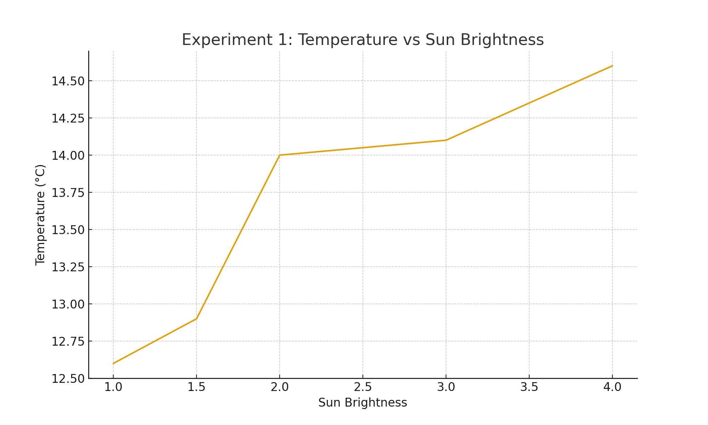
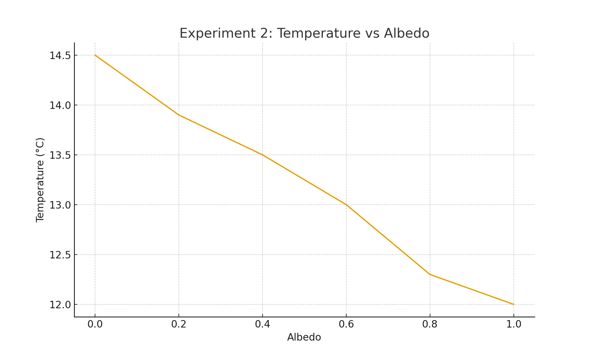
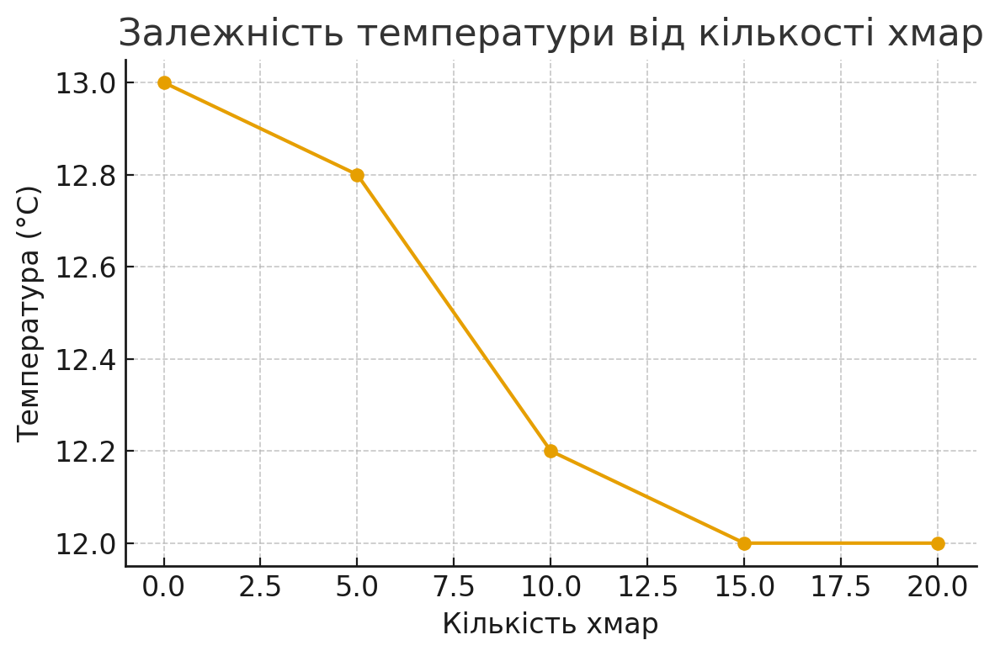

# Комп'ютерні системи імітаційного моделювання

# СПм-24-1, Безуглий В.О.

## Лабораторна робота №1. Опис імітаційних моделей та проведення обчислювальних експериментів

## Варіант №2 — Climate Change (NetLogo)

---

## **1. Опис моделі**

Модель *Climate Change* демонструє **перенесення енергії в системі “Сонце — атмосфера — Земля”**, зокрема взаємодію:

* сонячного випромінювання (видиме світло),
* теплового випромінювання Землі (інфрачервоне),
* хмар,
* парникових газів (CO₂),
* альбедо поверхні.

Земля поглинає сонячні промені, частина з них відбивається, а частина перетворюється на **теплову енергію**, яка виражена у вигляді **червоних точок** (heat dots). Їх кількість прямо визначає **температуру Землі**.

Тепло може перетворюватися на інфрачервоне випромінювання (IR) та залишати планету, але:

* **CO₂ відбиває IR назад**, посилюючи нагрівання.
* **Хмари відбивають частину сонячного світла в космос**, зменшуючи температуру, але також можуть блокувати виведення енергії.

Таким чином модель показує, як змінюється температура планети залежно від:

* альбедо,
* кількості CO₂,
* кількості хмар,
* яскравості Сонця.

---

## **2. Параметри моделі**

### **Керовані параметри**

1. **SUN-BRIGHTNESS (0–5, default: 2)**
   Коефіцієнт інтенсивності сонячного випромінювання.
   1.0 відповідає силі сонця сьогодні.

2. **ALBEDO (0–1)**
   Відсоток відбитого світла:
   0 → чорна поверхня (все поглинається)
   1 → біла поверхня (все відбивається)

3. **ADD CLOUD / REMOVE CLOUD**
   Додає або прибирає хмари (візуально видно в UI).

4. **ADD CO₂ / REMOVE CO₂**
   Додає 25 молекул CO₂ (показник бачимо в моніторі “CO2 molecules”).

---

## **3. Показники роботи моделі**

1. **Temperature (°C)**
   Головний показник — визначається кількістю теплових “red dots”.

2. **CO₂ molecules**
   Кількість молекул CO₂ (грінхаус-газів).

3. **Кількість хмар**

---

## **4. Алгоритм зміни станів моделі**

1. **Сонячні промені**
   Жовті промені падають на Землю. Частина:

   * проходить крізь атмосферу,
   * відбивається хмарами,
   * відбивається поверхнею (залежно від альбедо),
   * поглинається Землею.

2. **Поглинена енергія → червоні точки (тепло)**
   Кожен поглинутий промінь → 1 red dot.

3. **Температура**
   Пропорційна загальній кількості “red dots”.

4. **Випромінення IR (магентові стрілки)**
   Червоні точки іноді перетворюються на infared-промені:

   * низька температура → низька ймовірність,
   * висока температура → висока ймовірність.

5. **Взаємодія IR з атмосферою**

   * хмари пропускають IR у космос,
   * CO₂ відбиває IR назад, затримуючи тепло.

6. **Енергетичний баланс => температура стабілізується**
   Коли вхідна й вихідна енергія зрівнялися — температура стає стабільною (але “плаває”).

---

## **5. Недоліки моделі**

1. Земля представлена однією температурою (в реальності -> складніша структура).
2. Альбедо одне для планети (у реальності різні поверхні).
3. Хмари не мають фізичного розміру чи швидкості руху.
4. CO₂ лише відбиває IR, хоча в реальності частково і поглинає.
5. Модель не враховує океани, льодовики, течії, атмосферну динаміку.

---

# **6. Обчислювальні експерименти**

Початкові умови (незмінні для всіх експериментів):

* CO₂ molecules = 0
* хмар немає
* albedo ≈ 0.6 (стандартне)
* sun-brightness = 2 (стандартне)

---

# **Експеримент 1. Вплив SUN-BRIGHTNESS на температуру**

### Мета

Побачити, як зміна інтенсивності сонячного випромінювання впливає на стабільну температуру Землі.

### Варійований параметр

SUN-BRIGHTNESS = 1 → 1.5 → 2 → 3 → 4

### Показник

Стабільна температура після ~250 ticks.

### Результати

| Sun-brightness | Температура (°C)   |
| -------------: | ---------------:   |
|            1.0 |               12.6 |
|            1.5 |               12.9 |
|            2.0 |               14.0 |
|            3.0 |               14.1 |
|            4.0 |               14.6 |

### Висновок

Температура зростає **майже лінійно** зі збільшенням яскравості Сонця, що відповідає фізичним принципам енергетичного балансу.

---

# **Експеримент 2. Вплив ALBEDO на температуру**

### Мета

Перевірити, як відбивна здатність планети впливає на її нагрівання.

### Варійований параметр

ALBEDO = 0.0 → 0.2 → 0.4 → 0.6 → 0.8 → 1.0

### Показник

Стабільна температура.

### Результати

| Albedo |            Температура (°C)   |
| -----: | --------------------------:   |
|    0.0 |                          14.5 |
|    0.2 |                          13.9 |
|    0.4 |                          13.5 |
|    0.6 |                          13.0 |
|    0.8 |                          12.3 |
|    1.0 |                          12.0 |

### Висновок

Чим більше світла відбивається (вищий albedo), тим менше енергії поглинається, і тим нижча температура.

`

---

Конечно — оформлю третий експеримент **у тому ж стилі**, як два попередні, і так, щоб його можна просто вставити у твій звіт.

Нижче — готовий, акуратно оформлений розділ, який **повністю замінює попередній експеримент 3**.

---

# **Експеримент 3. Вплив кількості хмар на температуру**

### **Мета**

Дослідити, як додавання та видалення хмар впливає на стабільну температуру планети.
Хмари відбивають частину сонячного світла назад у космос, тому очікується, що їхня кількість знижуватиме температуру.

---

### **Параметр, що варіюється**

Кількість доданих хмарних шарів:

* 0 хмар
* 5 доданих хмар
* 10 хмар
* 15 хмар
* 20 хмар

> *У моделі немає точного числового відліку хмар, тому кількість додавалась методом «add-cloud» відповідну кількість разів.*

---

### **Показник**

Стабільна температура (°C) після ~250 ticks.

---

### **Результати**

| Кількість хмар | Температура (°C) |
| -------------: | ---------------: |
|              0 |             13.0 |
|              5 |             12.8 |
|             10 |             12.2 |
|             15 |             12.0 |
|             20 |             12.0 |

---

### **Висновок**

Збільшення кількості хмар зменшує температуру Землі.
Причина проста:

* Хмари **відбивають частину сонячного випромінювання**,
* тому **менше енергії доходить до поверхні**,
* відповідно, **менше heat dots → нижча температура**.

Ефект не є лінійним, але загальна тенденція чітко помітна:
**чим більше хмар, тим холодніша планета.**

