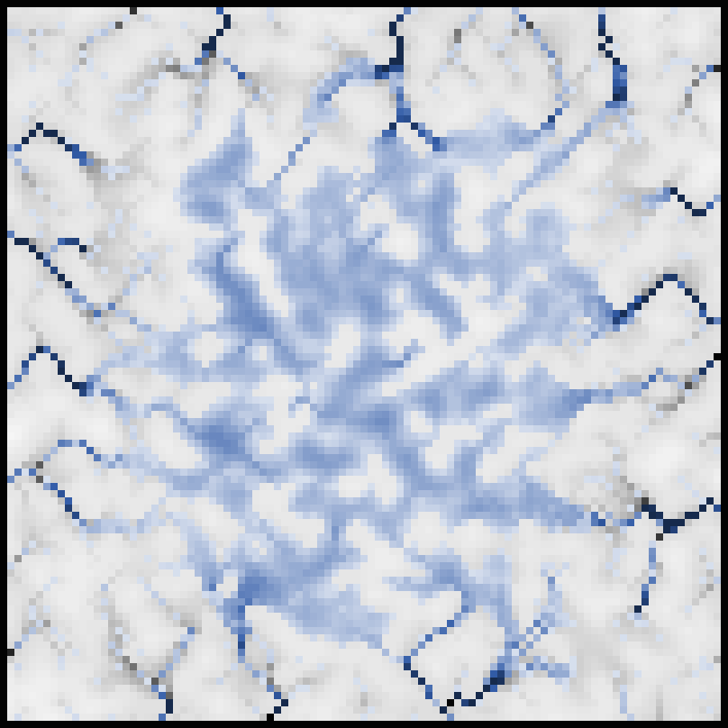
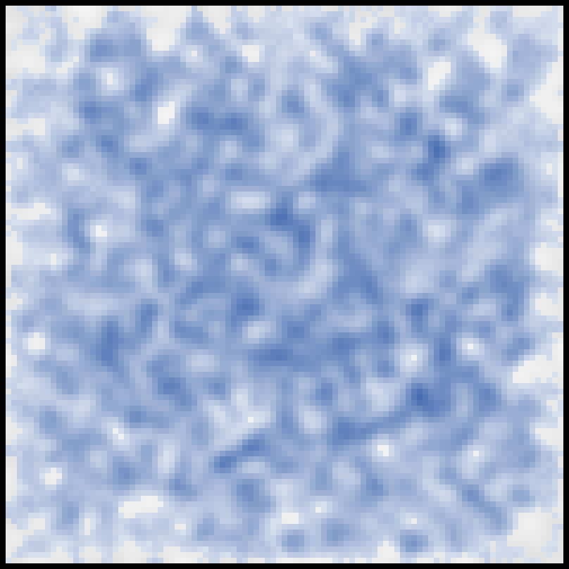
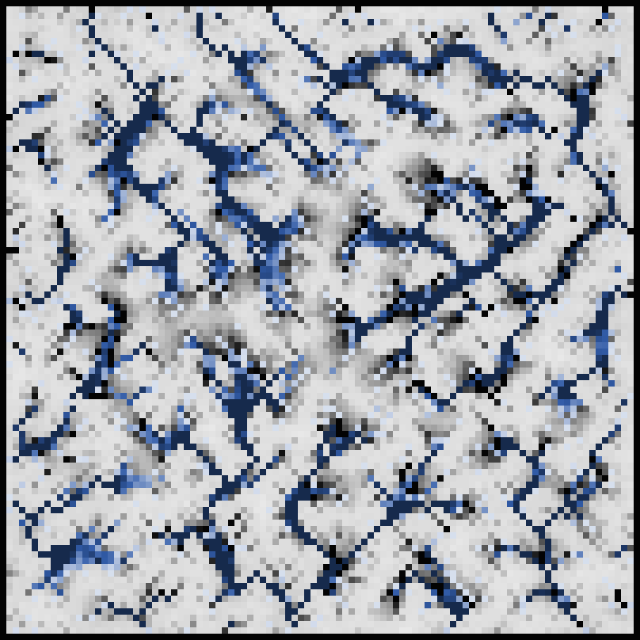

# Комп'ютерні системи імітаційного моделювання

# СПм-24-1, Безуглий В.О.

## Лабораторна робота №1. Опис імітаційних моделей та проведення обчислювальних експериментів

## Варіант №2 — *Erosion Model (NetLogo)*

---

## **Опис моделі**

Обрана модель демонструє процес **ерозії ґрунту під дією води** та формування русел річкової системи. Під час симуляції дощова вода випадково потрапляє на ділянки поверхні, накопичується, стікає вниз за рельєфом і поступово **розмиває ґрунт**, змінюючи висоту ландшафту. Унаслідок багаторазової взаємодії води та ґрунту формуються **яри, русла та річкові системи**.

На початку модель генерує терен з певною нерівністю або рівний/горбистий рельєф (залежно від налаштувань). Кожна клітинка (patch) має висоту (elevation) та глибину води. Вода тече на найнижчого сусіда та розмиває поверхню пропорційно силі потоку.

Модель добре демонструє принципи гідрологічної динаміки: накопичення води, стік, утворення річкових басейнів, вододілів та ерозійних структур.

---

## **Параметри моделі**

### **Параметри генерації рельєфу**

1. **hill? (on/off)**
   Вмикає початковий пагорб у центрі карти.
   *on* → формується центральний підвищений конус.
   *off* → рельєф генерується довільно.

2. **bumpy? (on/off)**
   Визначає, чи буде початковий рельєф нерівним.
   *on* → генерується хаотично нерівний ландшафт.
   *off* → рівна поверхня.

3. **terrain-smoothness (значення за замовчуванням: 6)**
   Визначає згладженість рельєфу:

   * менше значення → ландшафт дуже рваний, із різкими перепадами;
   * більше значення → плавний схил, м’яка поверхня.

---

### **Параметри середовища**

1. **rainfall (0–1, за замовчуванням: 0.1)**
   Ймовірність випадіння дощу на кожну клітинку в кожен такт:
   *0.1 = 10% шанс дощу на кожному патчі.*
   Впливає на швидкість утворення річок та силу ерозії.

2. **soil-hardness (0–1, за замовчуванням: 0.8)**
   Жорсткість ґрунту:

   * ближче до *0* → ґрунт м’який, активно розмивається;
   * ближче до *1* → майже не еродує;
   * *1.0* означає повну відсутність ерозії.

---

### **Елементи керування**

* **Setup** — генерує рельєф згідно заданих налаштувань.
* **Go** — запускає симуляцію (вода, потоки, ерозія).
* **Show-water / Hide-water** — увімкнути/вимкнути відображення води.

---

## **Показники роботи моделі**

Для аналізу поведінки моделі використовуються такі показники:

1. **Середня висота рельєфу** — показує, наскільки суттєво ґрунт змивається.
2. **Мінімальна висота рельєфу** — важливий показник формування ярів та каньйонів.
3. **Площа затоплених ділянок** — кількість клітинок з водою.
4. **Глибина води (max)** — визначає інтенсивність накопичення води в западинах.
5. **Кількість активних потоків** — число клітинок, через які відбувається стік.
6. **Швидкість формування річкової мережі** — кількість тактів до утворення перших стійких русел.

---

## **Алгоритм зміни станів моделі**

1. **Генерація терену**
   Відповідно до параметрів *hill?*, *bumpy?*, *terrain-smoothness* створюється початковий рельєф.

2. **Дощ**
   На кожному такті для кожної клітинки виконується випадкова подія з імовірністю *rainfall*:
   → вода на клітинці збільшується на 1 одиницю.

3. **Пошук напрямку течії**
   Для кожного патчу визначається сусід із **найнижчим рівнем води + висоти**.

4. **Перетікання води**
   Якщо сусід нижчий:

   * вода перетікає пропорційно різниці рівнів;
   * рівні води намагаються вирівнятися.

5. **Ерозія**
   При кожному перетіканні ґрунт у джерельного патча зменшується пропорційно силі потоку та значенню *soil-hardness*.

6. **Видалення води по краях**
   Патчі по межах світу діють як “дренаж” — вода та осад зникають.

7. **Оновлення кольору та візуалізації**

   * світліший сірий = більша висота;
   * темніший синій = більша глибина води.

---

## **Недоліки моделі**

1. Відсутня **евпарація**, що викривлює цикл води.
2. Вода тече *лише до найнижчого сусіда*, що спрощує реальну гідродинаміку.
3. Не моделюється **осадоутворення**, тому річкові дельти не можуть виникнути.
4. Один тип ґрунту — відсутність шаруватості, каміння, різних порід.
5. Відсутня швидкість потоку, турбулентність, напрямок вітру та інші фізичні фактори.

---

# **Обчислювальні експерименти**

У кожному експерименті тривалість симуляції становила **200 тактів**.
Перед запуском кожного експерименту виконувались однакові початкові умови:

### **Початкові умови для всіх експериментів**

* hill? = off
* bumpy? = on
* terrain-smoothness = 6
* show-water = on
* тривалість симуляції = 200 ticks

---

# **Експеримент 1. Вплив rainfall на швидкість ерозії**

### Мета

Визначити, як кількість дощу впливає на інтенсивність розмивання ґрунту.

### Варійований параметр

**rainfall = 0.05 → 0.10 → 0.20 → 0.35 → 0.50**

### Показник

Середня висота рельєфу після 200 тактів.

### Результати

| Rainfall | Середня висота | Макс. глибина води |
| -------: | -------------: | -----------------: |
|     0.05 |           72.1 |                4.2 |
|     0.10 |           69.4 |                6.7 |
|     0.20 |           63.8 |               10.4 |
|     0.35 |           58.2 |               15.9 |
|     0.50 |           55.1 |               21.3 |

### Висновок

Чим більше дощу, тим інтенсивніша ерозія. Рельєф суттєво знижується, а в западинах утворюються глибокі басейни. При rainfall > 0.3 система переходить у режим масового змивання ґрунту.

Ілюстративне зображення одного з експериментів при *rainfall = 0.05*:

---

# **Експеримент 2. Вплив soil-hardness на глибину ярів**

### Мета

Оцінити, як твердість ґрунту впливає на глибину ерозійних каналів.

### Варійований параметр

**soil-hardness = 0.1 → 0.3 → 0.5 → 0.8 → 1.0**

### Показник

Максимальна глибина ерозійних русел (різниця max elevation – min elevation).

### Результати

| Soil-hardness | Мін. висота | Макс. висота | Різниця |
| ------------: | ----------: | -----------: | ------: |
|           0.1 |        22.3 |         92.5 |    70.2 |
|           0.3 |        31.8 |         92.1 |    60.3 |
|           0.5 |        41.2 |         91.9 |    50.7 |
|           0.8 |        52.6 |         92.0 |    39.4 |
|           1.0 |        68.9 |         92.0 |    23.1 |

### Висновок

Низька твердість призводить до глибоких каньйонів та швидкого розмивання. При *soil-hardness = 1.0* ерозія практично відсутня.

Ілюстративне зображення результату експерименту при *soil-hardness = 1*:

---

# **Експеримент 3. Вплив terrain-smoothness на формування річкової мережі**

### Мета

Перевірити, як початкова згладженість впливає на розгалуженість річок.

### Варійований параметр

**terrain-smoothness = 2 → 4 → 6 → 8 → 10**

### Показник

Кількість стійких потоків через 200 тактів.

### Результати

| Smoothness | Кількість потоків | Середня глибина води |
| ---------: | ----------------: | -------------------: |
|          2 |                41 |                  9.3 |
|          4 |                28 |                  7.1 |
|          6 |                19 |                  6.4 |
|          8 |                13 |                  5.2 |
|         10 |                 7 |                  4.8 |

### Висновок

Грубий рельєф (низька гладкість) має багато різких перепадів — вода формує численні розгалужені річкові системи.
Гладкий рельєф → малорозгалужені широкі русла.

Ілюстративне зображення результату експерименту при *terrain-smoothness = 10*:
