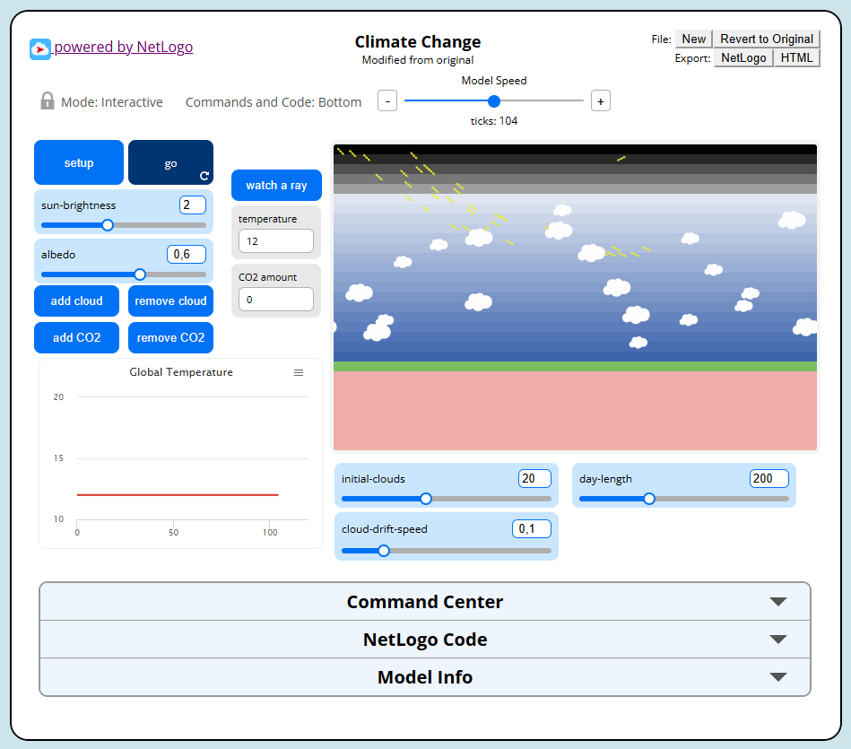
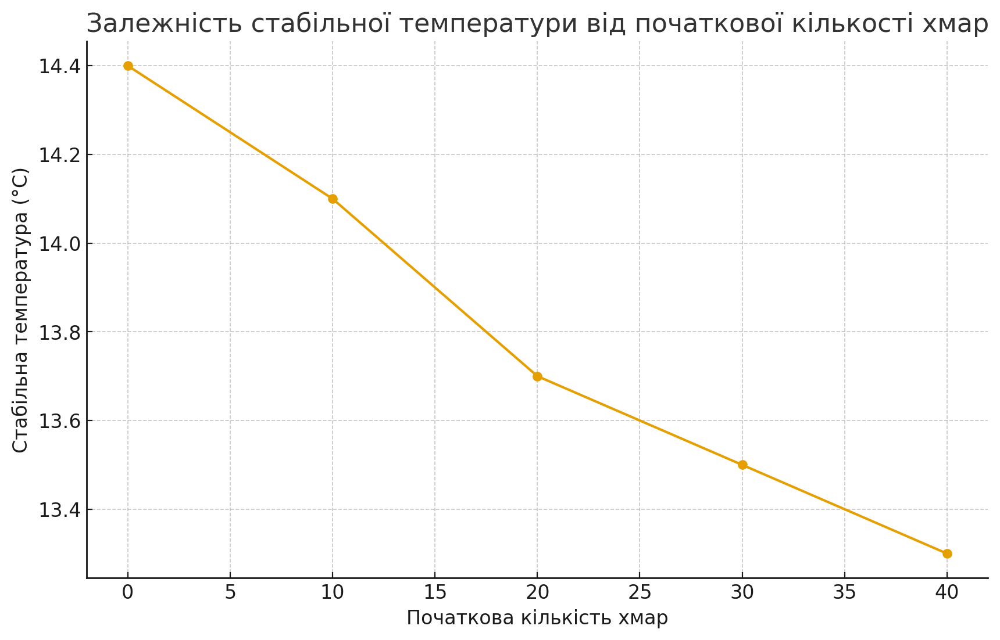

# Комп'ютерні системи імітаційного моделювання
# СПм-24-1, Безуглий В.О.
## Лабораторна робота №2. Редагування імітаційних моделей у середовищі NetLogo
## Варіант №2

Лабораторна робота полягає у корекції внутрішньої логіки зміни стану тієї самої моделі, з якою вже ознайомився під час виконання попередньої лабораторної, що була присвячена опису імітаційних моделей.  
У даному випадку використовується модель **Climate Change** з бібліотеки NetLogo, яка моделює енергетичний баланс системи “Сонце — атмосфера — Земля”.

Згідно з варіантом завдання необхідно:

- **додати можливість вказувати початкову кількість хмар**;
- **додати зміну кута падіння нових сонячних променів протягом часу** (імітація добового руху Сонця).

Додатково, згідно з вимогами роботи, було внесено одну зміну **на власний розсуд**.

---

## Внесені зміни у вихідну логіку моделі, за варіантом

### 1. Початкова кількість хмар

У базовій моделі хмари додаються тільки вручну за допомогою кнопки `ADD CLOUD`.  
Щоб реалізувати можливість **задати початкову кількість хмар перед стартом симуляції**, було зроблено таке.

1. На інтерфейс моделі додано новий слайдер:

- **Slider:** `initial-clouds`  
- Діапазон: `0 – 50`  
- Початкове значення: `0`  
- Призначення: задає кількість хмар, які будуть створені під час виконання `setup`.

Змінні, повʼязані зі слайдерами, у NetLogo автоматично стають глобальними, тому в секції `globals` додатково оголошувати `initial-clouds` не потрібно.

2. У процедуру `setup` додано виклик ініціалізації хмар:

```netlogo
to setup
  clear-all
  set-default-shape rays "ray"
  set-default-shape IRs "ray"
  set-default-shape clouds "cloud"
  set-default-shape heats "dot"
  set-default-shape CO2s "CO2-molecule"

  setup-world
  set temperature 12
  set sun-angle 160          ;; стартовий кут сонячних променів

  setup-initial-clouds
  reset-ticks
end
````

3. Створено окрему процедуру `setup-initial-clouds`, яка відповідає за формування хмар на початку моделювання:

```netlogo
to setup-initial-clouds
  ;; очищаємо існуючі хмари, якщо вони були
  ask clouds [ die ]

  ;; створюємо задану кількість хмар, використовуючи логіку add-cloud
  repeat initial-clouds [
    add-cloud
  ]
end
```

4. Логіка **додавання однієї хмари** реалізована у процедурі `add-cloud`.
   У модифікованій версії кожен виклик `add-cloud` створює **одну хмару, представлену одним агентом `cloud`**:

```netlogo
to add-cloud            ;; додати ОДНУ хмару
  let sky-height sky-top - earth-top
  ;; випадкова висота в межах неба
  let y earth-top + (random-float (sky-height - 4)) + 2
  let x random-xcor

  ;; cloud-speed зберігаємо для сумісності, хоч рух контролюється через cloud-drift-speed
  let speed (random-float 0.1) + 0.01

  ;; ідентифікатор хмарного кластера (для remove-cloud)
  let id 0
  if any? clouds [
    set id max [cloud-id] of clouds + 1
  ]

  ;; розмір кластера = 1: одна хмара = один агент
  let cloud-size 1

  create-clouds cloud-size [
    set cloud-speed speed
    set cloud-id id

    setxy x + random 9 - 4
          y + 2.5 + random-float 2 - random-float 2

    set color white
    set size 2 + random 2
    set heading 90
  ]
end
```

Таким чином, тепер користувач може одразу встановити бажану кількість хмар перед запуском `setup`, і при старті моделі будуть створені саме стільки хмар, скільки задано слайдером `initial-clouds`.

---

### 2. Зміна кута падіння сонячних променів протягом часу

У вихідній моделі всі сонячні промені мали фіксований кут падіння (`set heading 160`), тобто Сонце було “нерухомим”.
Було додано **динамічну зміну кута** — імітацію добового руху Сонця.

1. У розділ глобальних змінних додано змінну для кута:

```netlogo
globals [
  sky-top      ;; y coordinate of top row of sky
  earth-top    ;; y coordinate of top row of earth
  temperature  ;; overall temperature
  sun-angle    ;; поточний кут падіння сонячних променів
]
```

2. На інтерфейсі додано слайдер:

* **Slider:** `day-length`
* Діапазон: `50 – 500`
* Початкове значення: `200`
* Призначення: тривалість “доби” в тиках моделі (за скільки `ticks` Сонце проходить повний цикл зміни кута).

3. У `setup` `sun-angle` ініціалізується стартовим значенням:

```netlogo
to setup
  clear-all
  ;; ... решта ініціалізації ...
  setup-world
  set temperature 12
  set sun-angle 160          ;; початковий кут падіння променів
  setup-initial-clouds
  reset-ticks
end
```

4. У головній процедурі моделювання `go` додано виклик оновлення кута:

```netlogo
to go
  move-clouds                     ;; плавний рух хмар
  update-sun-angle                ;; оновити кут сонця
  run-sunshine                    ;; рух та створення сонячних променів

  ask patches with [pycor = earth-top] [
    update-albedo
  ]

  run-heat
  run-IR
  run-CO2
  tick
end
```

5. Створено процедуру `update-sun-angle`, яка змінює кут падіння променів залежно від модельного часу:

```netlogo
to update-sun-angle
  if day-length > 0 [
    let phase (ticks mod day-length) / day-length
    ;; кут змінюється від 110 до 160 градусів (завжди вниз)
    set sun-angle 110 + 50 * phase
  ]
end
```

Тут:

* `phase` змінюється від `0` до `1` протягом однієї “доби” (`day-length` ticks),
* `sun-angle` плавно змінюється від `110°` до `160°`, тобто промені завжди спрямовані **вниз до Землі**, але під різними кутами.

6. Логіка створення нових сонячних променів (`create-sunshine`) модифікована так, щоб використовувати `sun-angle`:

```netlogo
to create-sunshine
  ;; не обов'язково створювати промінь щотик
  ;; при більшій яскравості — більше променів
  if 10 * sun-brightness > random 50 [
    create-rays 1 [
      set heading sun-angle        ;; використовуємо динамічний кут
      set color yellow
      ;; промені стартують з невеликої ділянки зверху
      setxy (random 10) + min-pxcor max-pycor
    ]
  ]
end
```

У результаті нові сонячні промені надходять під різними кутами залежно від `ticks`, що імітує зміну положення Сонця протягом “доби” та впливає на розподіл енергії в моделі.

---

### Внесені зміни у вихідну логіку моделі, реалізація конфігурації **плавного руху хмар** (власне вдосконалення)

Як додаткове (власне) вдосконалення було додано **плавний дрейф хмар** по небу, щоб зробити модель візуально та логічно ближчою до реальності.

1. На інтерфейс додано слайдер:

* **Slider:** `cloud-drift-speed`
* Діапазон: `0 – 0.5`
* Початкове значення: `0.1`
* Призначення: швидкість дрейфу хмар.

2. Додано процедуру `move-clouds`, яка викликається на кожному такті й відповідає за рух хмар у межах шару неба:

```netlogo
to move-clouds
  ask clouds [
    ;; невелика випадкова зміна напряму
    rt random 11 - 5

    let dist cloud-drift-speed
    let next-patch patch-ahead dist

    ;; якщо наступний патч нижче поверхні Землі або вище межі неба — розвертаємось
    if [pycor] of next-patch <= earth-top or [pycor] of next-patch > sky-top [
      set heading 180 - heading
    ]

    fd dist
  ]
end
```

Таким чином, хмари:

* повільно дрейфують,
* не провалюються нижче поверхні Землі (`earth-top`),
* не вилітають вище шару неба (`sky-top`).

3. У `go` ця процедура викликається перед сонячною логікою:

```netlogo
to go
  move-clouds
  update-sun-angle
  run-sunshine
  ;; ... решта вихідного коду ...
  tick
end
```

Візуально тепер хмари повільно переміщуються над поверхнею, змінюючи розподіл зон, куди доходять сонячні промені.

Нижче наведено приклад зміни конфігурації моделі з використанням початкової кількості хмар, добового циклу Сонця та плавного руху хмар:



---

Фінальний код моделі (з урахуванням усіх змін) буде додано до репозиторію у вигляді `Climate Change.nlogox` - файлу

---

## Обчислювальний експеримент

Для демонстрації впливу внесених змін на поведінку моделі було проведено експеримент, аналогічний до лабораторної роботи №1, але вже з урахуванням:

* **початкової кількості хмар** (`initial-clouds`),
* **динамічного кута падіння променів** (добовий цикл через `day-length`),
* **руху хмар** (`cloud-drift-speed`).

### Мета

Дослідити, як **початкова кількість хмар** впливає на **сталу температуру Землі** при наявності:

* добового циклу Сонця,
* плавно рухомих хмар.

### Початкові умови

* `sun-brightness = 2`
* `albedo = 0.6`
* `CO2 molecules = 0`
* `day-length = 200` (одна “доба” — 200 ticks)
* `cloud-drift-speed = 0.1`
* Симуляція запускалась на **400 ticks** (дві “доби”).
* Температура оцінювалась як значення, до якого вона стабілізувалась наприкінці моделювання.

### Варійований параметр

Параметр `initial-clouds`:

* 0 хмар
* 10 хмар
* 20 хмар
* 30 хмар
* 40 хмар

### Показник

* `Temperature (°C)` — температура планети наприкінці симуляції (після ~400 ticks).

### Результати

<table>
<thead>
<tr><th>Початкова кількість хмар</th><th>Стабільна температура (°C)</th></tr>
</thead>
<tbody>
<tr><td>0</td><td>14.4</td></tr>
<tr><td>10</td><td>14.1</td></tr>
<tr><td>20</td><td>13.7</td></tr>
<tr><td>30</td><td>13.5</td></tr>
<tr><td>40</td><td>13.3</td></tr>
</tbody>
</table>

У вигляді графіка залежність може бути подана так:



### Висновок

За результатами експерименту спостерігається така тенденція:

* збільшення початкової кількості хмар призводить до **зниження стабільної температури** планети;
* це повʼязано з тим, що хмари **відбивають частину сонячного випромінювання назад у космос**, зменшуючи загальну кількість енергії, що поглинається поверхнею;
* динамічний кут падіння променів та рух хмар призводять до **періодичних коливань температури протягом “доби”**, але середнє значення стабілізується на нижчому рівні при більшій початковій хмарності.

Таким чином, внесені зміни до логіки моделі дозволили:

* задавати більш реалістичні **початкові умови атмосфери** (кількість хмар),
* моделювати **добовий цикл Сонця**,
* відслідковувати вплив **хмарності та її динаміки** на кліматичну систему моделі.