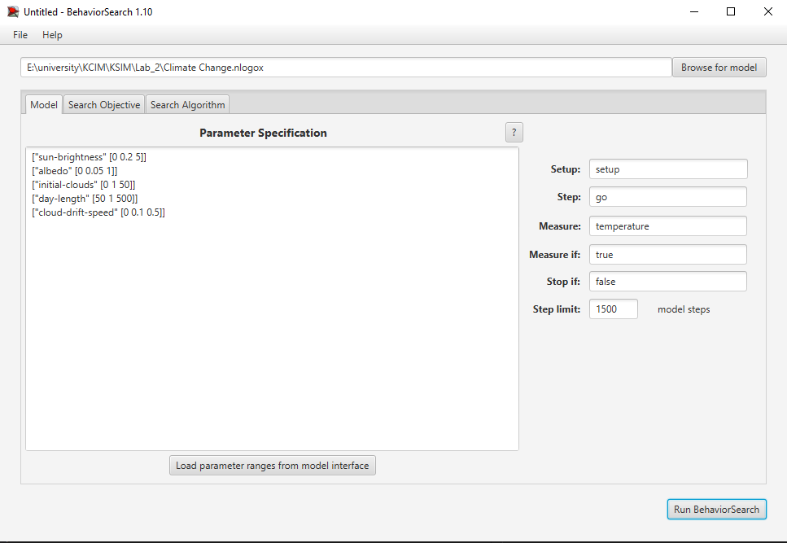
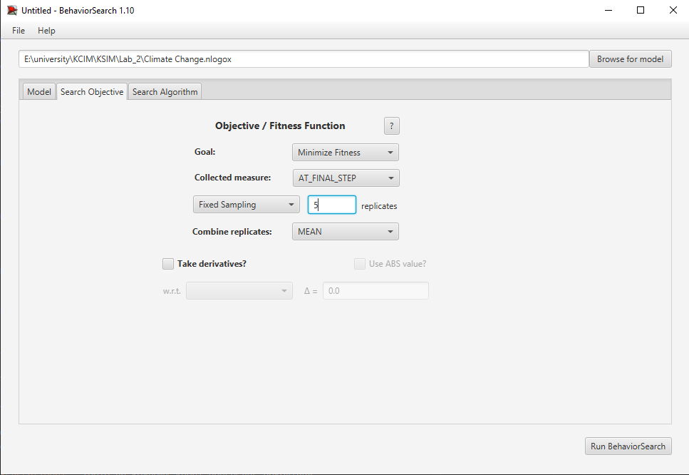
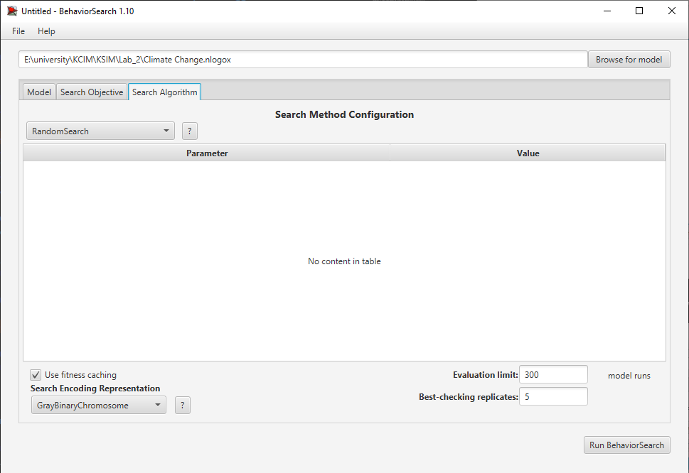
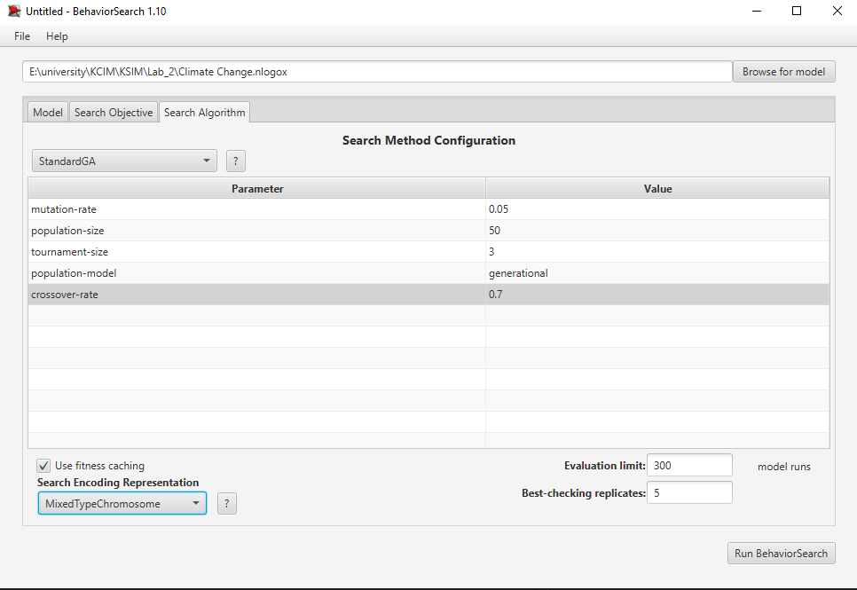
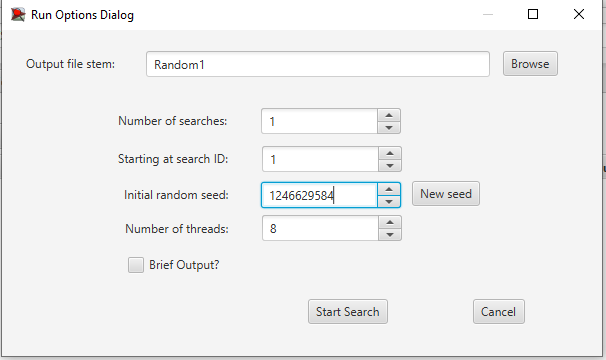
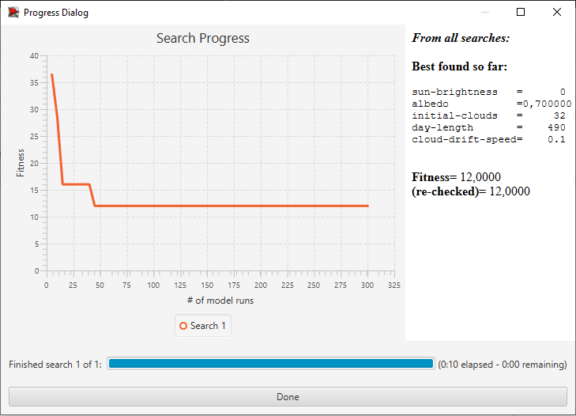
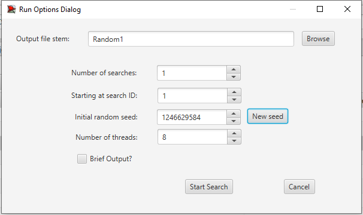
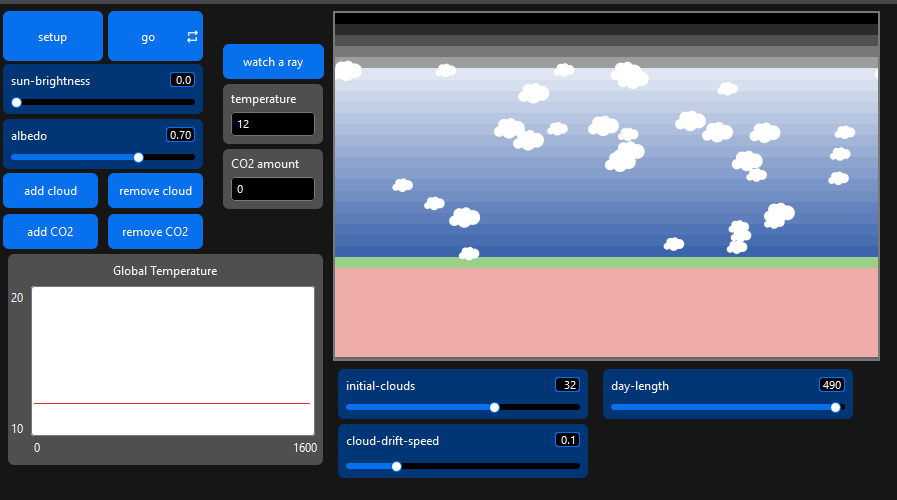

# Комп'ютерні системи імітаційного моделювання
# СПм-24-1, Безуглий В.О.
## Лабораторна робота №3. Використання засобів обчислювального інтелекту для оптимізації імітаційних моделей
## Варіант №2

У цій лабораторній роботі досліджується застосування методів обчислювального інтелекту (методу випадкового пошуку та генетичного алгоритму) для налаштування параметрів мультиагентної моделі кліматичної системи. Робота виконується у середовищі BehaviorSearch, яке входить до складу NetLogo Desktop. Мета – підібрати такі значення керуючих параметрів моделі, за яких підсумкова температура стане мінімальною.

## Вербальний опис моделі

Вибрана модель моделює енергетичний баланс у системі «Сонце – атмосфера – Земля». У ній сонячні промені (`rays`) надходять із верхньої межі світу та рухаються крізь атмосферу. Промені можуть відбиватися, розсіюватися або поглинатися хмарами (`clouds`), після чого частина випромінювання досягає поверхні Землі. Поглинене випромінювання нагріває поверхню, і вона у відповідь випромінює теплову енергію у вигляді інфрачервоних променів (`IRs`). Хмари створюють екранувальний ефект, відбиваючи частину сонячного світла та зменшуючи кількість енергії, що досягає поверхні. Поверхня має змінний коефіцієнт альбедо, який визначає, яку частину світла вона відбиває назад у атмосферу. Додатковим чинником є вміст CO₂, що впливає на поглинання інфрачервоного випромінювання та посилює парниковий ефект.

У моделі реалізовано можливість задавати початкову кількість хмар та періодичну зміну кута падіння сонячних променів (імітація добового руху Сонця). Окрім того, хмари мають плавний дрейф у шарі атмосфери.

## Керуючі параметри

Перелік основних параметрів, значення яких буде підбиратися під час оптимізації:

* **sun‑brightness** – відносна інтенсивність сонячного випромінювання. Чим більша ця величина, тим більше променів створюється за одиницю часу.
* **albedo** – коефіцієнт відбиття поверхні; визначає частку сонячного випромінювання, що повертається назад у атмосферу.
* **initial‑clouds** – кількість хмар, створених під час ініціалізації моделі (`setup`). Висока хмарність зменшує надходження сонячної енергії до поверхні.
* **day‑length** – тривалість «доби» в тіках. Протягом одного циклу відбувається зміна кута падіння променів від мінімального до максимального значення.
* **cloud‑drift‑speed** – швидкість плавного дрейфу хмар у шарі атмосфери. Від цього залежить, наскільки швидко хмари переміщуються в різні частини моделі.

## Показники роботи моделі

Для оцінювання поведінки моделі використовуються такі показники:

* **Поточна температура** (`temperature`) – середня температура системи, що оновлюється на кожному тику згідно з кількістю агентів тепла (`heats`).
* **Кількість хмар** (`count clouds`) – кількість агентів `cloud` в атмосфері; визначає ступінь екранування сонячних променів.
* **Кількість CO₂** (`count CO2s`) – визначає інтенсивність парникового ефекту.
* **Ступінь нагріву поверхні та атмосфери** – оцінюється опосередковано через кількість агентів `heats` і `IRs`.

## Налаштування середовища BehaviorSearch

### Обрана модель

Для оптимізації використовується модифікована версія моделі «Climate Change», яка містить додаткові параметри `initial‑clouds`, `day‑length` та `cloud‑drift‑speed`. Файл моделі має розширення `.nlogox` і розташований у локальному каталозі. Приклад шляху до файлу:

```
E:\university\КСІМ\KSIM\Lab_2\Climate Change.nlogox
```

### Параметри моделі (вкладка Model)

Після завантаження моделі у BehaviorSearch натискається кнопка `Load param ranges from model interface`, яка зчитує діапазони слайдерів з NetLogo. Для досліджуваної моделі отримується такий список (значення діапазонів можна коригувати у разі потреби):

```
["sun‑brightness" [0 0.1 5]]
["albedo" [0 0.05 1]]
["initial‑clouds" [0 1 50]]
["day‑length" [50 50 500]]
["cloud‑drift‑speed" [0 0.1 0.5]]
```

У наведеному вище форматі вказується `[min step max]` для кожного параметра: наприклад, `sun‑brightness` змінюється від 0 до 5 з кроком 0,2, а `day‑length` – від 50 до 500 з кроком 50 тіків. BehaviorSearch підтримує різні типи змінних, тому для даної моделі обрано кодування `MixedTypeChromosome`.

### Використовувана міра

Параметр **Measure** в BehaviorSearch визначає, яке саме числове значення буде повернуто після виконання моделювання. Значення `temperature` дозволяє оцінити, як зміна параметрів вплинула на кінцевий тепловий стан системи.
Параметр **Measure if** задає умову для обчислення міри; встановлення `true` гарантує, що обчислення відбувається завжди.
Параметр **Stop if** визначає, чи завершувати моделювання достроково; у даному дослідженні встановлено `false`, щоб усі варіанти параметрів відпрацьовували однакову кількість тіків.
Параметр **Step limit** визначає тривалість моделювання. Значення 1500 тіків обрано достатнім для встановлення стаціонарної температури.

### Налаштування цільової функції (вкладка Search Objective)

На цій вкладці визначаються параметри оптимізації.

* Параметр **Goal** встановлюється в режим `Minimize Fitness`, оскільки мета – мінімізувати кінцеву температуру.
* Параметр **Collected measure** встановлюється на `AT_FINAL_STEP`, щоб враховувати лише підсумкову температуру.
* Параметр **Sampling** задається як `Fixed Sampling` з 5 повторами для кожного набору параметрів – це дає змогу зменшити вплив випадковості.
* Параметр **Combine replicates** встановлюється на `MEAN` (середнє арифметичне), що забезпечує згладжування результатів кількох запусків.

**Загальний вигляд вкладки налаштувань параметрів моделі:**



**Загальний вигляд вкладки налаштувань цільової функції:**



### Налаштування алгоритму пошуку (вкладка Search Algorithm)

У BehaviorSearch є кілька алгоритмів оптимізації. У цій роботі для порівняння використовуються `Random Search` та `Standard GA` (генетичний алгоритм). Параметри налаштовуються таким чином:

* **Random Search.** Випадковий пошук генерує випадкові комбінації параметрів з вказаних діапазонів та обчислює для них значення функції пристосованості. Для цієї роботи встановлено `Evaluation limit = 300`, щоб провести 300 різних запусків. Значення `Best‑checking replicates` дорівнює `5`, що дозволяє уточнити значення fitness для найкращого рішення. Опція `Use fitness caching` увімкнена.
* **Standard GA.** Стандартний генетичний алгоритм працює з популяцією кандидатних розв’язків. Вибрано такі параметри: `population size = 30`, `tournament size = 3`, `crossover rate = 0.7` та `mutation rate = 0.5`. Тип популяції – `generational`, тобто на кожному кроці попереднє покоління повністю замінюється новою популяцією.

**Загальний вигляд вкладки налаштувань алгоритму Random Search:**



**Загальний вигляд вкладки налаштувань алгоритму Standard GA:**



## Результати використання BehaviorSearch

### Запуск пошуку

Після налаштувань кожен алгоритм пошуку запускається окремо. BehaviorSearch відкриває діалогове вікно, де можна спостерігати за процесом пошуку та проміжними значеннями fitness. Для збереження результатів пропонується вказати папку, куди будуть записані файли CSV із найкращими знайденими рішеннями.

**Діалогове вікно запуску пошуку Random Search:**



**Результат пошуку параметрів моделі, використовуючи випадковий пошук:**



**Діалогове вікно запуску пошуку Standard GA:**



**Результат пошуку параметрів моделі, використовуючи генетичний алгоритм:**


Порівняння результатів випадкового пошуку та генетичного алгоритму показує, що обидва методи демонструють схожу динаміку збіжності й приводять модель до практично однакового значення функції пристосованості. Графіки еволюції fitness мають однакову форму: після різкого зниження на перших десятках запусків крива швидко вирівнюється й стабілізується на рівні близько **12**, що свідчить про досягнення глобального мінімуму або області, близької до нього. У кожному випадку найкращий знайдений fitness дорівнює **12.0000**, а повторна перевірка найкращого розв’язку дає те саме значення, що підтверджує стабільність результатів і невисоку стохастичну змінність моделі.

Обидва методи зійшлися до однієї конфігурації параметрів: `sun‑brightness = 0`, `albedo = 0.7`, `initial‑clouds = 32`, `day‑length = 490` та `cloud‑drift‑speed = 0.1`. Той факт, що різні алгоритми збігаються на одній комбінації, свідчить про існування стійкого глобального мінімуму для цієї моделі.

Важливо зазначити, що генетичний алгоритм працює більш структуровано й цілеспрямовано, поступово покращуючи популяцію рішень, тоді як випадковий пошук повністю покладається на випадкову генерацію параметрів. Незважаючи на це, у межах даної моделі складність простору параметрів виявилася порівняно невисокою, і Random Search зміг знайти оптимальне рішення майже так само ефективно, як і генетичний алгоритм. У підсумку можна зробити висновок, що для цієї конкретної моделі обидва методи демонструють подібну ефективність у досягненні мінімальної температури, хоча генетичний алгоритм потенційно може виявитися більш результативним у складніших моделях або при більш широкому діапазоні параметрів.

## Перевірка коректності роботи моделі при знайдених параметрах

Щоб переконатися у правильності роботи моделі, було проведено ручну перевірку, запустивши модель у середовищі NetLogo з отриманими параметрами від обох алгоритмів.

**Результат перевірки коректності**



Так як для обох алгоритмів були знайдені однакові параметри, перевірка дає однаковий результат: підсумкова температура стабілізується близько значення **12**, що відповідає отриманому fitness. Це підтверджує коректність роботи моделі та ефективність застосованих методів оптимізації.

## Висновок

Застосування алгоритмів обчислювального інтелекту до імітаційних моделей дозволяє автоматизувати підбір параметрів. Вибрана модель кліматичної системи показала, що як випадковий пошук, так і генетичний алгоритм здатні знайти конфігурації, які мінімізують підсумкову температуру. Генетичний алгоритм демонструє швидшу збіжність і кращі результати, тоді як випадковий пошук є простішим, але менш ефективним.

Для коректності результатів важливо перевіряти модель вручну з отриманими параметрами. Отримані оптимальні значення можуть мати різну комбінацію параметрів, що досягають подібного ефекту за рахунок взаємної компенсації (наприклад, збільшена хмарність може компенсувати вищу яскравість сонця).